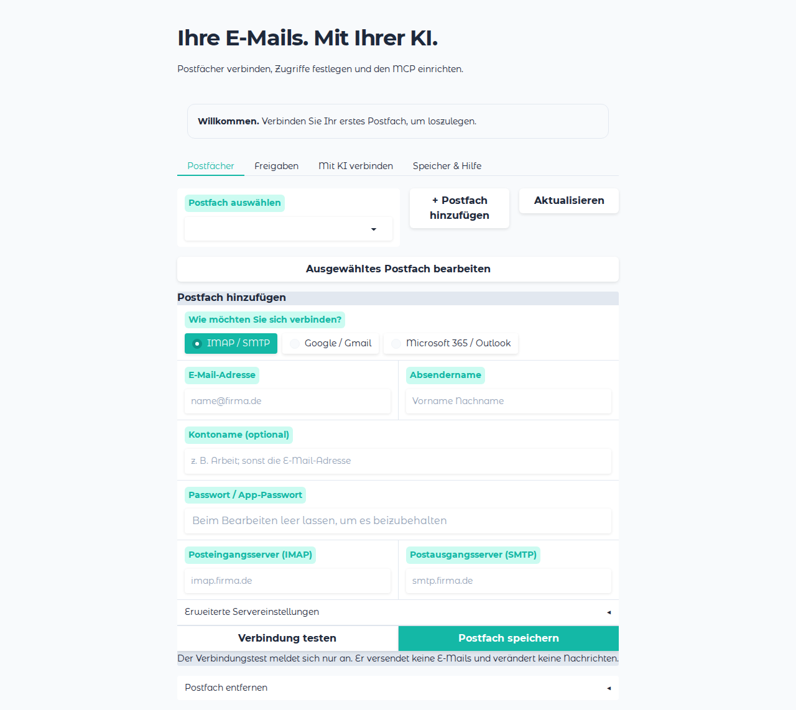

# mcp-email-server

[](https://img.shields.io/github/v/release/ai-zerolab/mcp-email-server)
[](https://github.com/ai-zerolab/mcp-email-server/actions/workflows/main.yml?query=branch%3Amain)
[](https://codecov.io/gh/ai-zerolab/mcp-email-server)
[](https://img.shields.io/github/commit-activity/m/ai-zerolab/mcp-email-server)
[](https://img.shields.io/github/license/ai-zerolab/mcp-email-server)
[](https://smithery.ai/server/@ai-zerolab/mcp-email-server)

IMAP and SMTP via MCP Server

## Für Kunden: starten und einrichten

Ein allgemeiner MCP-Server mit lokaler Gradio-Oberfläche, klassischem IMAP/SMTP und
Google-/Microsoft-Anmeldung über OAuth. Die nativen Windows-/Linux-Pakete benötigen keine Python-Installation.

1. Passendes Release-Archiv entpacken und `mcp-email-server.exe` (Windows) beziehungsweise `mcp-email-server` (Linux) starten.
2. Unter **Postfächer** ein Konto hinzufügen. Für Google/Microsoft führt die UI Schritt für Schritt durch die Einrichtung
   einer eigenen OAuth-App beim Anbieter. Es wird keine zentrale App des Herausgebers vorausgesetzt.
3. Verbindung testen und speichern. Unter **Freigaben** bei Bedarf Empfänger und Anhang-Downloads freigeben.
4. Unter **Mit KI verbinden** den MCP-Eintrag übernehmen oder die bestehende Ariadne-Integration nutzen.

Die [Kundenanleitung](docs/customer-setup.md) beschreibt Installation, Speicherorte, Migration und Fehlerhilfe.
Für Entwickler: `uv run mcp-email-server ui`.



- **Github repository**: <https://github.com/ai-zerolab/mcp-email-server/>
- **Documentation** <https://ai-zerolab.github.io/mcp-email-server/>

## Installation

### Manual Installation

We recommend using [uv](https://github.com/astral-sh/uv) to manage your environment.

Try `uvx mcp-email-server@latest ui` to config, and use following configuration for mcp client:

```json
{
  "mcpServers": {
    "zerolib-email": {
      "command": "uvx",
      "args": ["mcp-email-server@latest", "stdio"]
    }
  }
}
```

This package is available on PyPI, so you can install it using `pip install mcp-email-server`

After that, configure your email server using the ui: `mcp-email-server ui`

### Environment Variable Configuration

You can also configure the email server using environment variables, which is particularly useful for CI/CD environments like Jenkins. zerolib-email supports both UI configuration (via TOML file) and environment variables, with environment variables taking precedence.

```json
{
  "mcpServers": {
    "zerolib-email": {
      "command": "uvx",
      "args": ["mcp-email-server@latest", "stdio"],
      "env": {
        "MCP_EMAIL_SERVER_ACCOUNT_NAME": "work",
        "MCP_EMAIL_SERVER_FULL_NAME": "John Doe",
        "MCP_EMAIL_SERVER_EMAIL_ADDRESS": "john@example.com",
        "MCP_EMAIL_SERVER_USER_NAME": "john@example.com",
        "MCP_EMAIL_SERVER_PASSWORD": "your_password",
        "MCP_EMAIL_SERVER_IMAP_HOST": "imap.gmail.com",
        "MCP_EMAIL_SERVER_IMAP_PORT": "993",
        "MCP_EMAIL_SERVER_SMTP_HOST": "smtp.gmail.com",
        "MCP_EMAIL_SERVER_SMTP_PORT": "465"
      }
    }
  }
}
```

#### Available Environment Variables

| Variable                                      | Description                                      | Default       | Required |
| --------------------------------------------- | ------------------------------------------------ | ------------- | -------- |
| `MCP_EMAIL_SERVER_ACCOUNT_NAME`               | Account identifier                               | `"default"`   | No       |
| `MCP_EMAIL_SERVER_FULL_NAME`                  | Display name                                     | Email prefix  | No       |
| `MCP_EMAIL_SERVER_EMAIL_ADDRESS`              | Email address                                    | -             | Yes      |
| `MCP_EMAIL_SERVER_USER_NAME`                  | Login username                                   | Same as email | No       |
| `MCP_EMAIL_SERVER_PASSWORD`                   | Email password                                   | -             | Yes      |
| `MCP_EMAIL_SERVER_IMAP_HOST`                  | IMAP server host                                 | -             | Yes      |
| `MCP_EMAIL_SERVER_IMAP_PORT`                  | IMAP server port                                 | `993`         | No       |
| `MCP_EMAIL_SERVER_IMAP_SSL`                   | Enable IMAP SSL                                  | `true`        | No       |
| `MCP_EMAIL_SERVER_SMTP_HOST`                  | SMTP server host                                 | -             | Yes      |
| `MCP_EMAIL_SERVER_SMTP_PORT`                  | SMTP server port                                 | `465`         | No       |
| `MCP_EMAIL_SERVER_SMTP_SSL`                   | Enable SMTP SSL                                  | `true`        | No       |
| `MCP_EMAIL_SERVER_SMTP_START_SSL`             | Enable STARTTLS                                  | `false`       | No       |
| `MCP_EMAIL_SERVER_ENABLE_ATTACHMENT_DOWNLOAD` | Enable attachment download                       | `false`       | No       |
| `MCP_EMAIL_SERVER_SAVE_TO_SENT`               | Save sent emails to IMAP Sent folder             | `true`        | No       |
| `MCP_EMAIL_SERVER_SENT_FOLDER_NAME`           | Custom Sent folder name (auto-detect if not set) | -             | No       |

### Enabling Attachment Downloads

By default, downloading email attachments is disabled for security reasons. To enable this feature, you can either:

**Option 1: Environment Variable**

```json
{
  "mcpServers": {
    "zerolib-email": {
      "command": "uvx",
      "args": ["mcp-email-server@latest", "stdio"],
      "env": {
        "MCP_EMAIL_SERVER_ENABLE_ATTACHMENT_DOWNLOAD": "true"
      }
    }
  }
}
```

**Option 2: TOML Configuration**

Add `enable_attachment_download = true` to your TOML configuration file (`~/.config/zerolib/mcp_email_server/config.toml`):

```toml
enable_attachment_download = true

[[emails]]
# ... your email configuration
```

Once enabled, you can use the `download_attachment` tool to save email attachments to a specified path.

### Saving Sent Emails to IMAP Sent Folder

By default, sent emails are automatically saved to your IMAP Sent folder. This ensures that emails sent via the MCP server appear in your email client (Thunderbird, webmail, etc.).

The server auto-detects common Sent folder names: `Sent`, `INBOX.Sent`, `Sent Items`, `Sent Mail`, `[Gmail]/Sent Mail`.

**To specify a custom Sent folder name** (useful for providers with non-standard folder names):

**Option 1: Environment Variable**

```json
{
  "mcpServers": {
    "zerolib-email": {
      "command": "uvx",
      "args": ["mcp-email-server@latest", "stdio"],
      "env": {
        "MCP_EMAIL_SERVER_SENT_FOLDER_NAME": "INBOX.Sent"
      }
    }
  }
}
```

**Option 2: TOML Configuration**

```toml
[[emails]]
account_name = "work"
save_to_sent = true
sent_folder_name = "INBOX.Sent"
# ... rest of your email configuration
```

**To disable saving to Sent folder**, set `MCP_EMAIL_SERVER_SAVE_TO_SENT=false` or `save_to_sent = false` in your TOML config.

For separate IMAP/SMTP credentials, you can also use:

- `MCP_EMAIL_SERVER_IMAP_USER_NAME` / `MCP_EMAIL_SERVER_IMAP_PASSWORD`
- `MCP_EMAIL_SERVER_SMTP_USER_NAME` / `MCP_EMAIL_SERVER_SMTP_PASSWORD`

Then you can try it in [Claude Desktop](https://claude.ai/download). If you want to intergrate it with other mcp client, run `$which mcp-email-server` for the path and configure it in your client like:

```json
{
  "mcpServers": {
    "zerolib-email": {
      "command": "{{ ENTRYPOINT }}",
      "args": ["stdio"]
    }
  }
}
```

If `docker` is avaliable, you can try use docker image, but you may need to config it in your client using `tools` via `MCP`. The default config path is `~/.config/zerolib/mcp_email_server/config.toml`

```json
{
  "mcpServers": {
    "zerolib-email": {
      "command": "docker",
      "args": ["run", "-it", "ghcr.io/ai-zerolab/mcp-email-server:latest"]
    }
  }
}
```

### Installing via Smithery

To install Email Server for Claude Desktop automatically via [Smithery](https://smithery.ai/server/@ai-zerolab/mcp-email-server):

```bash
npx -y @smithery/cli install @ai-zerolab/mcp-email-server --client claude
```

## MCP Tools

The server exposes MCP resources/tools for email workflows.

- Resource `email://{account_name}`
  - Returns masked account configuration for the given account.

- Tool `list_available_accounts()` → list of accounts
  - Returns masked attributes for configured email/provider accounts.

- Tool `add_email_account(email: EmailSettings)` → string
  - Adds an account and persists to TOML. Returns a success message.

- Tool `list_emails_metadata(account_name, page=1, page_size=10, before?, since?, subject?, from_address?, to_address?, order?, mailbox?)`
  - Paginates metadata; use returned IMAP UIDs with `get_emails_content` to fetch full messages.

- Internal Python function `send_email(account_name, recipients, subject, body, cc?, bcc?)` → string (not exposed as an MCP tool)
  - Sends an email (UTF‑8 safe subject/sender). Returns: `"Email sent successfully to <first-recipient>"`.
  - Controlled by env: disabled by default. Set `MCP_EMAIL_SERVER_ENABLE_SENDING=true` (or `1/yes/on`) to enable. When disabled, the tool raises a permission error.

- Tool `get_allowed_recipients()` → object
  - Returns restricted tool recipients: `{ "allowed_recipients": [...], "error": null }`.
  - If none configured: `{ "allowed_recipients": [], "error": "No allowed recipients configured." }`.

- Tool `send_email_to_allowed_recipients(to, subject, body)` → object
  - Uses a fixed account configured under **Freigaben** in the UI.
  - `to` must be a non-empty list and every address must be valid + included in the allowed list.
  - Returns compact JSON:
    - Success: `{ "success": true, "message": "Email sent successfully", "sent_to": [...] }`
    - Errors: `{ "success": false, "error": "<reason>" }`
  - Before using this tool, call `get_allowed_recipients` to retrieve the list of approved addresses.

- Tool `list_folders(account_name)` → list[str]
  - Lists IMAP folders.

- Tool `move_email(account_name, email_id, source_folder, destination_folder)` → object
  - `email_id` must be the IMAP UID from `list_emails_metadata` (not the RFC `message_id` header).
  - Copies to destination and flags the source as deleted. Returns the destination UID when available; otherwise look it up in the destination folder. Does not globally expunge unrelated deleted messages.

- Internal Python function `delete_emails(account_name, email_ids, mailbox=\"INBOX\")` → string (not exposed as an MCP tool)
  - `email_ids` are IMAP UIDs from `list_emails_metadata`.
  - Flags deleted and expunges.

- Tool `get_full_email_body(account_name, email_id, folder=\"INBOX\")` → str
  - Convenience wrapper for a single message body lookup by IMAP UID (`email_id`).
  - Prefer `get_emails_content` when you also need metadata or attachments.

- Tool `mark_email(account_name, email_id, folder=\"INBOX\", mark)` → bool
  - `email_id` must be the IMAP UID from `list_emails_metadata`.
  - Marks message using IMAP flags. `mark` in `{ "read", "unread", "flagged", "unflagged", "answered", "draft" }`.

### Google and Microsoft OAuth

Google and Microsoft accounts use `EmailSettings.oauth` and XOAUTH2 over IMAP/SMTP, so the existing mail and folder tools remain available. The UI provides customer-owned app registration instructions, browser login with PKCE, and connection diagnostics. Tokens are refreshed automatically and stored in the operating-system keyring. Provider/tenant consent and enabled mail protocols are prerequisites. The legacy generic `ProviderSettings` API-key model still has no handler; it is not the OAuth account format.

Example invocation (arguments shape) for `page_email`:

```json
{
  "account_name": "work",
  "page": 1,
  "page_size": 10,
  "since": "2024-01-01T00:00:00Z",
  "subject": "invoice",
  "order": "desc"
}
```

## Usage

### Replying to Emails

To reply to an email with proper threading (so it appears in the same conversation in email clients):

1. First, fetch the original email to get its `message_id`:

```python
emails = await get_emails_content(account_name="work", email_ids=["123"])
original = emails.emails[0]
```

2. Send your reply using `in_reply_to` and `references`:

```python
await send_email(
    account_name="work",
    recipients=[original.sender],
    subject=f"Re: {original.subject}",
    body="Thank you for your email...",
    in_reply_to=original.message_id,
    references=original.message_id,
)
```

The `in_reply_to` parameter sets the `In-Reply-To` header, and `references` sets the `References` header. Both are used by email clients to thread conversations properly.

Important: `message_id` (RFC header used for threading) is different from `email_id` (IMAP UID used by `get_emails_content`, `get_full_email_body`, `move_email`, `mark_email`, and `delete_emails`).

## Development

This project is managed using [uv](https://github.com/ai-zerolab/uv).

Try `make install` to install the virtual environment and install the pre-commit hooks.

Use `uv run mcp-email-server` for local development.

## Releasing a new version

- Create an API Token on [PyPI](https://pypi.org/).
- Add the API Token to your projects secrets with the name `PYPI_TOKEN` by visiting [this page](https://github.com/ai-zerolab/mcp-email-server/settings/secrets/actions/new).
- Create a [new release](https://github.com/ai-zerolab/mcp-email-server/releases/new) on Github.
- Create a new tag in the form `*.*.*`.

For more details, see [here](https://fpgmaas.github.io/cookiecutter-uv/features/cicd/#how-to-trigger-a-release).

## Build native binaries

Build on the target operating system; PyInstaller does not cross-compile Windows from Linux.

```bash
uv sync --locked
uv run pyinstaller --noconfirm --clean mcp_email_server.spec
uv run python dev/smoke_binary.py dist/mcp-email-server
```

On Windows, the executable and smoke-test argument are `dist/mcp-email-server.exe`.
The committed spec bundles the Gradio UI, provider setup guides, OAuth support and credential-store backends.
Do not regenerate the spec or include a customer's configuration in the build.

The `Windows and Linux binaries` workflow builds x86-64 executables on Windows 2022 and Ubuntu 22.04,
runs tests, checks the MCP handshake/tool list, and starts the packaged UI from a clean directory.
Pull requests and main builds produce downloadable artifacts. A published release attaches ZIP/tar.gz archives
and SHA-256 checksums after both native builds pass. Linux release builds target glibc 2.35 or newer;
a local build inherits the build machine's glibc requirement.

For a browser regression check and screenshots, developers can run:

```bash
uv run --with playwright playwright install chromium
uv run --with playwright python dev/smoke_ui.py
```

The browser check uses temporary demo settings. OAuth provider consent itself must be checked with a
customer-owned application and mailbox; no shared publisher application or account is bundled.
