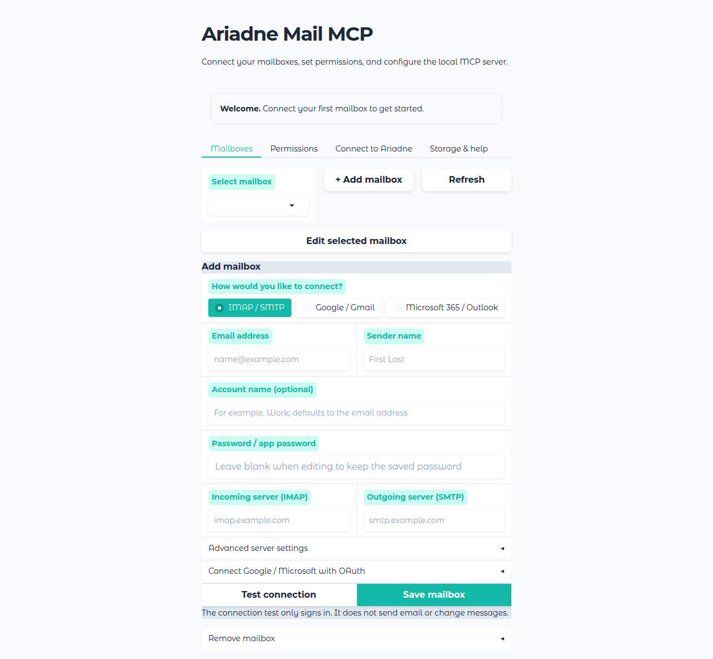

# Ariadne Mail MCP

A local MCP server for IMAP and SMTP mailboxes, with a setup UI and customer-owned Google or Microsoft OAuth apps. MCP communication uses local stdio only.

## Documentation

- [User setup](docs/user-setup.md): install, connect mailboxes, set permissions, and troubleshoot.
- [Configuration reference](docs/configuration.md): complete `config.toml` example, field descriptions, and environment variables.
- [Administrator security overview](docs/admin-security.md): trust boundary, stored secrets, OAuth grants, and dependency status.

## Quick start

1. Extract the Windows or Linux x86-64 release archive. Start `ariadne-mail-mcp.exe` on Windows or `./ariadne-mail-mcp` on Linux. This opens the setup UI on `127.0.0.1`.
2. Under **Mailboxes**, add an IMAP/SMTP, Google, or Microsoft account. Test the connection and save it.
3. Under **Permissions**, select an account and approved recipients only if the AI should send mail. Keep attachment download disabled for this release.
4. Under **Connect to Ariadne**, copy the MCP entry into Ariadne Engine's `mcp_servers.json`. The Engine starts the executable with `stdio`; the setup UI can then be closed.



## Configuration and sending safety

Run `ariadne-mail-mcp config-path` to locate `config.toml`. Native binaries keep it in `mcp_email_server/config.toml` beside the executable; Python installs use the user profile directory. `MCP_EMAIL_SERVER_CONFIG_PATH` selects a custom location. The existing `MCP_EMAIL_SERVER_*` environment variable names remain supported for compatibility. The [configuration reference](docs/configuration.md) shows the full TOML structure and every supported account variable.

The published sending tool, `send_email_to_allowed_recipients`, is **blocked by default**. It works only when `ai_sends_email_tool.allowed_account_name` identifies an account and `ai_sends_email_tool.allowed_recipients` contains the approved addresses. Configure these in the UI or in TOML:

```toml
[ai_sends_email_tool]
allowed_account_name = "work"
allowed_recipients = ["approved@example.com"]
```

Every recipient in a tool call must be approved. The unrestricted `send_email` function is internal and is not published as an MCP tool. `MCP_EMAIL_SERVER_ENABLE_SENDING` controls that internal function only; it does **not** enable or disable the published restricted tool. The internal function is disabled by default and raises `PermissionError` unless the variable is true. A separately approved unrestricted MCP tool is reserved for a later release. Attachment download is disabled by default and should stay disabled for this release.

## Ariadne Engine connection

In the native Ariadne Engine bundle, `mcp_servers.json` sits beside `model_config.json`. Add the generated `ariadne-mail-mcp` entry inside its existing `mcpServers` object; keep other servers. Ariadne Engine accepts the Claude-compatible `command`, `args`, and `env` fields for stdio servers. The program's UI generates this format with the actual program and config paths. [Ariadne Engine's MCP documentation](https://github.com/Ariadne-Industries-GmbH/Ariadne-Engine/blob/main/README.md) describes the global file and per-user registrations.

An example with placeholder paths:

```json
{
  "mcpServers": {
    "ariadne-mail-mcp": {
      "command": "/absolute/path/to/ariadne-mail-mcp",
      "args": ["stdio"],
      "env": {
        "MCP_EMAIL_SERVER_CONFIG_PATH": "/absolute/path/to/mcp_email_server/config.toml"
      }
    }
  }
}
```

On Windows, use the `.exe` path; the UI escapes paths correctly in JSON. Restart Ariadne Engine after changing the global file. The Engine and this program must run on the same computer, with paths and keyring credentials available to the Engine user. Other MCP clients that accept the Claude-style `mcpServers` format can use the same entry. The MCP CLI exposes only local stdio. The setup UI has no login and should be used in a trusted local session.

## Development

Use [uv](https://docs.astral.sh/uv/) with Python 3.10 or later:

```sh
uv sync --locked
uv run ariadne-mail-mcp ui
uv run pytest -q
uv run mkdocs build -s
uv run pyinstaller --noconfirm --clean mcp_email_server.spec
```

The native CI binary uses Python 3.12 on Windows and Linux and is checked with `dev/smoke_binary.py`. The internal Python module remains `mcp_email_server` for compatibility.

## Origin and license

This is an independently maintained continuation. The original project is identified in [NOTICE](NOTICE); its copyright notice and BSD 3-Clause terms are preserved in [LICENSE](LICENSE). Ariadne Industries GmbH holds rights to its additional contributions. The original authors do not endorse this project.
