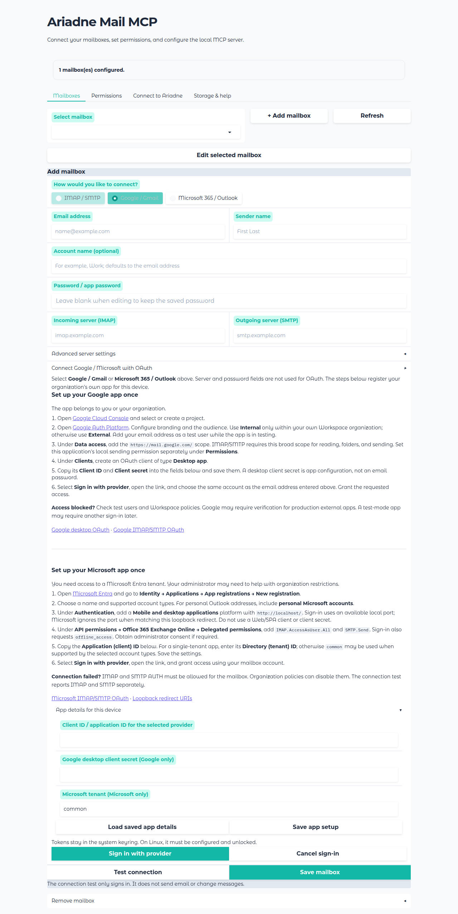
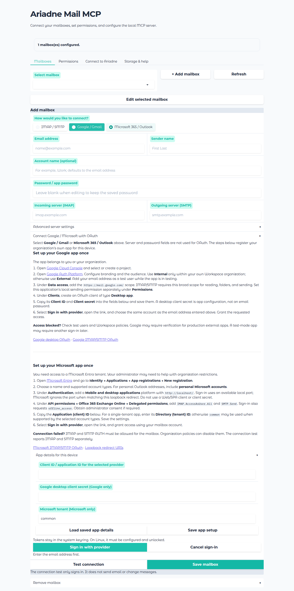

# User setup

## Start the native program

Download the Windows or Linux x86-64 release archive, extract it, and keep the files together. Run `ariadne-mail-mcp.exe` on Windows or `./ariadne-mail-mcp` on Linux. On Linux, use `chmod +x ariadne-mail-mcp` if needed. The setup UI opens in a browser on the same computer. Python is not required.

The Linux binary targets glibc 2.35 or newer (for example, Ubuntu 22.04). OAuth also requires the operating system's keyring. Windows uses its credential store; Linux needs a user D-Bus session and an unlocked Secret Service keyring.

If port 8765 is in use, run `ariadne-mail-mcp ui --port 8766`. Use `ariadne-mail-mcp ui --no-open-browser` to avoid opening a browser automatically. The UI binds only to `127.0.0.1`; it has no separate login. Use it only in a trusted local user session.

## Connect a mailbox

In **Mailboxes**, select a sign-in method:

- **IMAP / SMTP:** Enter the address, password or app password, and both server names. Advanced settings include separate login names, ports, encryption, and the sent folder.
- **Google / Gmail:** Follow the on-screen guide to create your own Google desktop OAuth app, grant the required mail scope, and sign in.
- **Microsoft 365 / Outlook:** Follow the on-screen guide to create your own Entra desktop app with delegated IMAP and SMTP permissions. Your administrator may need to approve these permissions or enable mailbox access.

Each user or organization creates its own provider app. This program has no shared publisher app. Provider consent happens in your browser, and user OAuth tokens are stored in the system keyring. Sign-in expires after three minutes and can be retried or cancelled.

The provider guides are embedded in the UI and can be opened during setup:





**Test connection** checks IMAP and SMTP separately, without sending or changing mail. After OAuth sign-in, the mailbox is saved only if both connections succeed. When editing a saved mailbox, leave password fields blank to keep the stored values.

## Set permissions

In **Permissions**, select the account and recipients allowed for the restricted AI sending tool. Sending through this tool remains blocked without both. Reading, moving, and marking messages remain available. Unrestricted sending and deletion are not published as MCP tools. The provider OAuth grant can be broader than these local tool permissions.

Attachment download is off by default. Leave it off for this release; path restrictions are planned for a later update. See the [administrator security overview](admin-security.md).

## Connect Ariadne Engine

In **Connect to Ariadne**, copy the generated JSON entry. For a native Ariadne Engine installation, open `mcp_servers.json` next to `model_config.json` and add the `ariadne-mail-mcp` entry inside its existing `mcpServers` object. Keep every existing server entry. Ariadne Engine accepts this Claude-compatible `command` + `args` + `env` form and treats it as local stdio. See the [Ariadne Engine MCP configuration](https://github.com/Ariadne-Industries-GmbH/Ariadne-Engine/blob/main/README.md).

For example, after adjusting both paths to the **Engine computer**, the file can contain:

```json
{
  "mcpServers": {
    "ariadne-mail-mcp": {
      "command": "/absolute/path/to/ariadne-mail-mcp",
      "args": ["stdio"],
      "env": {
        "MCP_EMAIL_SERVER_CONFIG_PATH": "/absolute/path/to/mcp_email_server/config.toml"
      }
    }
  }
}
```

The UI generates the actual paths and valid JSON escaping, including for Windows. The entry contains no passwords or tokens. Restart Ariadne Engine after editing its global file so it synchronizes the MCP registry; the setup UI can be closed. Ariadne Engine also supports per-user MCP registrations when its administrator allows them. Its global file is the straightforward route for a native single-user bundle.

The Engine starts the MCP process on its own computer. If it runs elsewhere, install and configure this program there and generate paths from that computer. OAuth keyring entries are tied to an operating system user and do not move with TOML. The separate **Register through the Ariadne Engine API** control in the setup UI also registers a stdio process, but file-based setup does not require an API key.

### Other MCP clients

The same exported `mcpServers` entry can be used by clients that accept the Claude-style format. For clients with separate fields, use the executable path as `command`, `stdio` as the argument, and the config path as an environment variable. No network MCP endpoint is available.

## Configuration location and removal

- Native Windows/Linux binary: `mcp_email_server/config.toml` in a folder beside the executable.
- Python package on Windows: `%APPDATA%\zerolib\mcp_email_server\config.toml`.
- Python package on Linux: `$XDG_CONFIG_HOME/zerolib/mcp_email_server/config.toml`, normally `~/.config/zerolib/mcp_email_server/config.toml`.
- Custom path: set `MCP_EMAIL_SERVER_CONFIG_PATH`. Run `ariadne-mail-mcp config-path` to see the active path.

On first UI or stdio start, a native binary copies an existing profile configuration to its adjacent folder if no local file exists. It also copies `oauth-clients.json` when present. The source remains until removed. A custom configuration path disables automatic migration.

Classic passwords remain in local TOML. New files have mode `0600` on Linux; on Windows, the selected folder's permissions determine access. OAuth app credentials are in `oauth-clients.json` beside the config; user tokens reside only in the keyring. Environment account variables override file accounts, appear as managed in the UI, and are not written to the file when other settings are saved. Running MCP processes load file changes on the next tool call.

For direct edits, see the [complete `config.toml` example and field reference](configuration.md), including the exact sending permission keys and environment variables.

`ariadne-mail-mcp reset` removes the active local config, adjacent OAuth app data, stored OAuth tokens it can identify, and any old profile copy used for migration. If keyring access fails, reset stops without deleting the config. A reset marker prevents migration from importing another legacy copy on the next start. Delete the program folder and any client registration separately when decommissioning.

## Troubleshooting

- **Google blocks access:** Check the desktop client type, test users, audience, and Workspace policies. Production external apps with mail access may require Google verification.
- **Microsoft rejects the redirect:** Register `http://localhost/` under the desktop platform, rather than a web or SPA platform.
- **Microsoft sign-in succeeds but IMAP/SMTP fails:** Ask the administrator to check IMAP and SMTP AUTH for the mailbox and organization.
- **Keyring unavailable:** On Linux, start an unlocked Secret Service keyring in the same user session as the MCP process. OAuth tokens have no plaintext fallback.
- **Sign-in required again:** Provider grants can expire or be revoked. Edit the account and sign in again; valid refresh tokens are renewed automatically.

Official references: [Google desktop OAuth](https://developers.google.com/identity/protocols/oauth2/native-app), [Google mail OAuth](https://developers.google.com/workspace/gmail/imap/xoauth2-protocol), [Microsoft IMAP/SMTP OAuth](https://learn.microsoft.com/en-us/exchange/client-developer/legacy-protocols/how-to-authenticate-an-imap-pop-smtp-application-by-using-oauth), [Microsoft redirect URIs](https://learn.microsoft.com/en-us/entra/identity-platform/reply-url).
